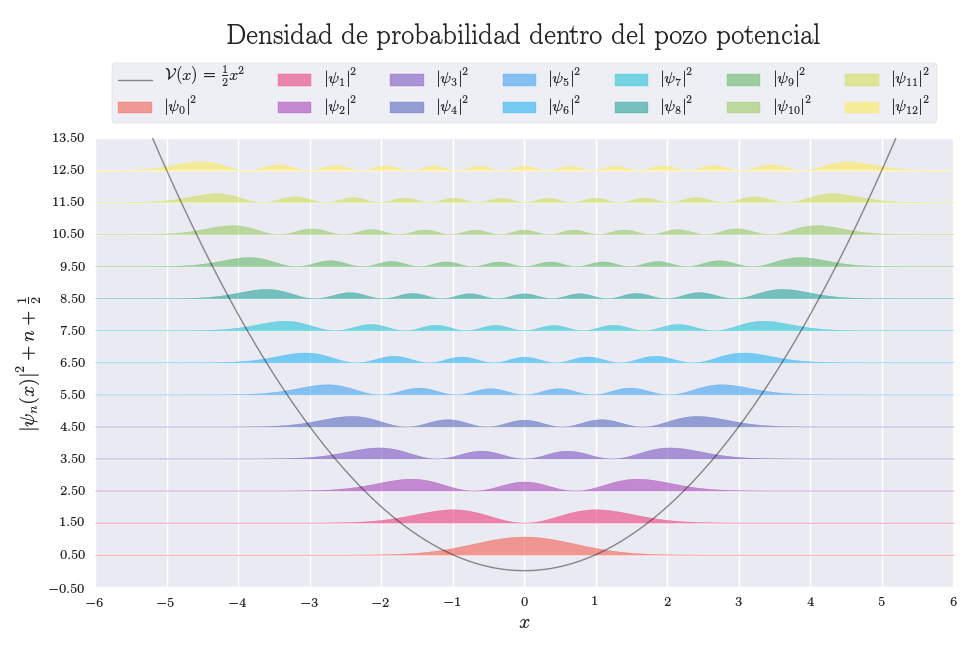

# Quantum harmonic oscillator

[][1]
[![MIT License][2]][1] [![Python][3]][1] [![HTML5][4]][1] [![MD][5]][1] [![Jupyter Notebook][6]][1] [![Physics][7]][1]

A Sample article completely writen in Jupyter Notebook whit some ugly hacks for html formatting :sweat_smile:

This notebook can be used to show some capabilities of Jupyter Notebook :snake:, to explain the quantum harmonic oscilator :cat2: or to show some fancy graphs :sunglasses:

PS: The article is written in Spanish


## Where to see

See this notebook on

* [Github](https://goo.gl/eAjjwx)
* [nbviewer](https://goo.gl/ZcR7JE)
* [Anaconda Cloud](https://goo.gl/nVOvTg)


## How to use

1. Clone the repository
    ```bash
    git clone https://github.com/zodiacfireworks/quantum-harmonic-oscillator.git
    ```

1. Create a conda environment
    ```bash
    conda create -n qho python=3 anaconda
    ```

2. Start the jupyter nothebook server
    ```bash
    jupyter notebook
    ```

3. Waits until the web browser is open, navigate to the repository directory and enjoy :smile:


## Author

* [@zodiacfireworks](https://github.com/zodiacfireworks)


## Licensing

All resources developed by me in this repository is released under the MIT license.

```text
    The MIT License

    Copyright (c) 2016 Martin Josemaría, http://zodiacfireworks.github.io/

    Permission is hereby granted, free of charge, to any person obtaining a copy
    of this software and associated documentation files (the "Software"), to deal
    in the Software without restriction, including without limitation the rights
    to use, copy, modify, merge, publish, distribute, sublicense, and/or sell
    copies of the Software, and to permit persons to whom the Software is
    furnished to do so, subject to the following conditions:

    The above copyright notice and this permission notice shall be included in
    all copies or substantial portions of the Software.

    THE SOFTWARE IS PROVIDED "AS IS", WITHOUT WARRANTY OF ANY KIND, EXPRESS OR
    IMPLIED, INCLUDING BUT NOT LIMITED TO THE WARRANTIES OF MERCHANTABILITY,
    FITNESS FOR A PARTICULAR PURPOSE AND NONINFRINGEMENT. IN NO EVENT SHALL THE
    AUTHORS OR COPYRIGHT HOLDERS BE LIABLE FOR ANY CLAIM, DAMAGES OR OTHER
    LIABILITY, WHETHER IN AN ACTION OF CONTRACT, TORT OR OTHERWISE, ARISING FROM,
    OUT OF OR IN CONNECTION WITH THE SOFTWARE OR THE USE OR OTHER DEALINGS IN
    THE SOFTWARE.
```

Resource with its respective licences are protectect by them.

If you find copyright protected content or without its respective credits,
please let us know to give the respective credits and to put the things in
order according to laws.

[1]: git@github.com:zodiacfireworks/meteorological-faker.git
[2]: https://img.shields.io/badge/License-MIT-blue.svg?maxAge=2592000&style=flat-square
[3]: https://img.shields.io/badge/Language-Python-green.svg?maxAge=2592000&style=flat-square
[4]: https://img.shields.io/badge/Language-HTML5-orange.svg?maxAge=2592000&style=flat-square
[5]: https://img.shields.io/badge/Language-Markdown-lightgrey.svg?maxAge=2592000&style=flat-square
[6]: https://img.shields.io/badge/Tool-Jupyter%20Notebook-orange.svg?maxAge=2592000&style=flat-square
[7]: https://img.shields.io/badge/Topic-Physics-green.svg?maxAge=2592000&style=flat-square
